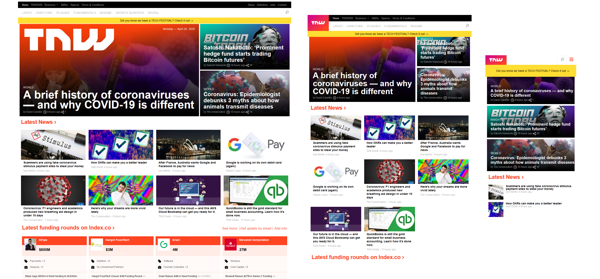

# MC-project6
Building with responsive design

## Microverse HTML/CSS project 6
This project consists of replicating [The Next Web](https://thenextweb.com/) front page layout.  

#### I. The project was based on a responsive layout with the next break points:
 - For mobile displays with a screen smaller than 768px.
 - For tablet displays with a screen smaller than 1024 px.
 - For desktop displays with a screen wider than 1024 px.

#### II. The layout was built with HTML and CSS,  focusing on responsiveness and making use of:
 - Grid elements
 - Flexboxes
 - Floating elements
 - positioning
 - SVG images
 - Backgrounds and gradients

#### III. The main areas of the project can be divided as follows:

  ###### &nbsp; The header
  It was created to remain fixed on the top of the page and adding elements according to the page width.

  ###### &nbsp; The main content
  It comprises the main layout areas, all of which are organized, aligned and justified within a grid system.

  ###### &nbsp; The footer
  It contains the media links and the copyright notice.

## Built With

- HTML & CSS
- Code Editors- Atom

## Live Demo

- [Live Demo Link](https://rawcdn.githack.com/Jhdezj/MC-project6/d5b879cae85d586fbf321600b590214a86642557/index.html)

## Author

👤 **Jorge Hernandez**

- Github: [@Jhdezj](https://github.com/Jhdezj)
